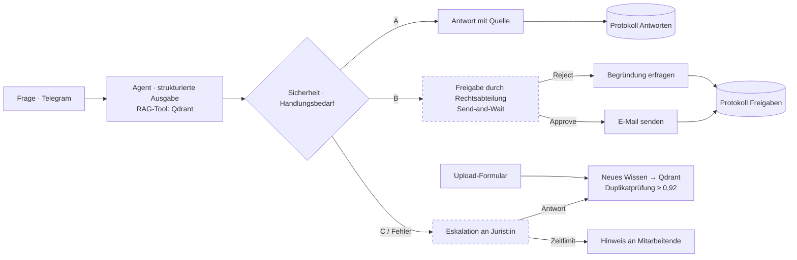

# Architektur / Architecture

| Workflow | Aufgabe / Purpose |
|---|---|
| `P9_Legal-Navigator_MAIN` | Agent, drei Ausgänge, Freigabe, Eskalation, Lernen / agent with three outcomes |
| `P9_Legal-Guide-Upload` | Handbuch (PDF/DOCX) → Text → Qdrant |
| `P9_Error-Handler` | meldet Ausfälle an den Admin / reports failures |
